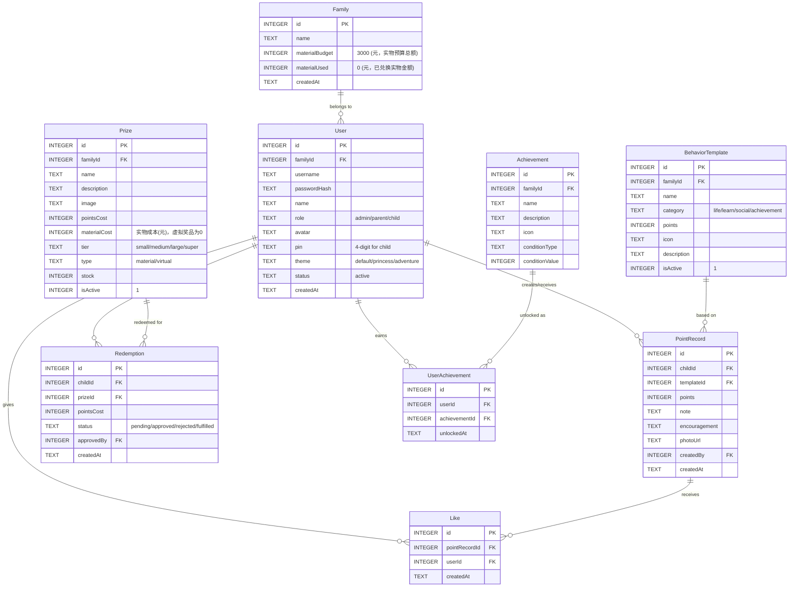
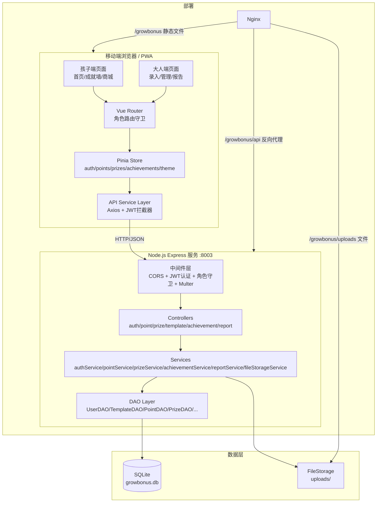
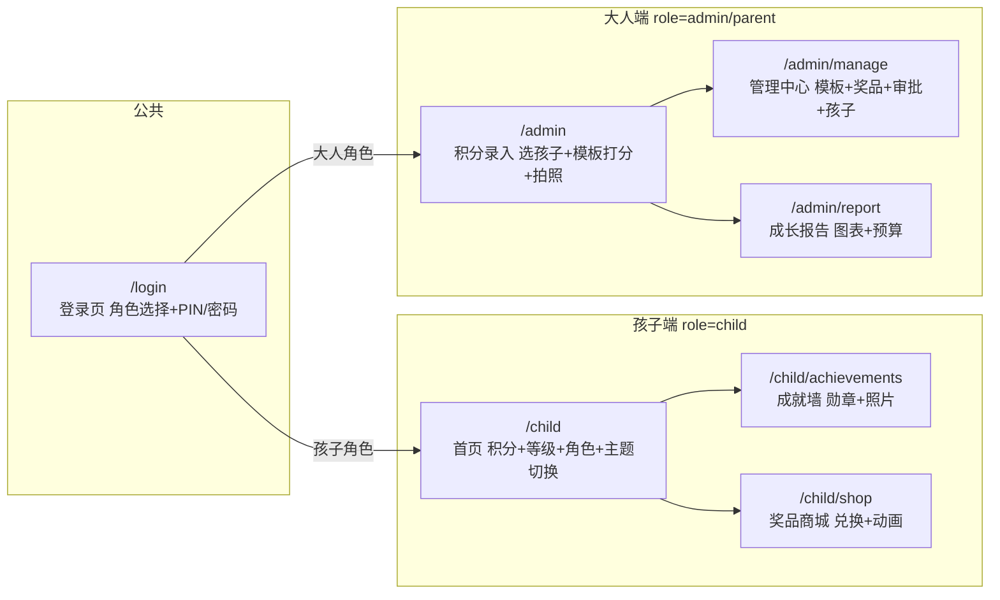

## 产品概述

GrowBonus（成长奖励）是一个移动端优先的家庭教育激励PWA系统，为5岁小侄女量身打造。通过积分奖励正向行为、兑换奖品的方式，远程助力孩子成长。系统支持多角色协作（叔叔管理、父母录入、孩子互动），实物奖品年预算3000元（积分无上限，实物兑换金额封顶）。

## 核心功能

### 1. 角色与权限体系

- 管理员（叔叔）：全部权限，管理奖品库、行为模板、查看成长报告、审批兑换、管理孩子账号
- 家长（父母）：按模板录入积分、查看成长报告、给孩子点赞鼓励、选择为哪个孩子打分
- 孩子（侄女）：查看积分和等级、浏览成就墙、兑换奖品（需大人确认）、查看奖品橱窗、切换主题风格

### 2. 行为积分模板系统

- 预设四大类行为模板：生活习惯（1-2分）、学习技能（3-5分）、社交品格（5-8分）、特别成就（20-50分）
- 大人按模板快速打分，一键录入，可附带鼓励语和成就照片
- 管理员可自定义新增/编辑/删除行为模板
- 通过模板固定分值控制积分通胀
- 积分无上限，孩子做好事就能一直获得积分，保持激励持续性

### 3. 奖品商城与兑换

- 四档奖品：小奖（20分/约25元）、中奖（80分/约100元）、大奖（200分/约250元）、超级奖（500分/约625元）
- 奖品分两类：
- 🎁 实物奖品：有明确人民币成本，兑换时从3000元年度预算中扣减实际金额
- 💫 虚拟奖品：零成本（如"和叔叔视频通话30分钟"、"超级宝贝称号"），不消耗预算，可无限兑换
- 兑换需大人确认后生效
- 实物预算追踪：追踪已兑换实物的金额总和（非积分总量），接近80%时提醒管理员，用完时提示"实物奖品暂时兑完啦，还有好多有趣的特别奖励可以兑换哦！"
- 管理员可随时追加预算（如第二年再加3000）
- 奖品橱窗展示，配合可爱图片和描述

### 4. 图片上传与成长轨迹

- 成就/行为可以拍照上传，记录成长轨迹
- 服务器本地存储图片，代码层做存储抽象方便后续迁移腾讯COS
- 成就墙展示成就照片

### 5. 孩子端深度互动体验

- 卡通首页：展示当前积分、成长等级、角色动画（种子到开花的成长过程）
- 成就墙：展示获得的勋章和历史记录，网格式展示已解锁/未解锁状态，含成就照片
- 微动画激励效果（3-5秒）：获得积分时星星飞入、兑换时开宝箱、连续打卡角色成长
- 大按钮大图标，适合5岁孩子操作

### 6. 主题切换

- 孩子端支持主题切换功能，通过下拉/选择器切换
- 初期提供3个主题：默认卡通风、粉色公主风、蓝色冒险风
- CSS变量切换 + 图标/背景图资源切换，每个主题定义一组配色、图标集、背景图

### 7. 多孩子与多家庭扩展

- V1支持一个家庭内多个孩子，各自独立积分和成就
- 数据模型预留familyId字段，未来支持多家庭注册使用
- 积分录入时需选择为哪个孩子打分

### 8. 家庭互动与提醒

- 家人点赞鼓励功能
- 大人录入积分时可附带文字鼓励语
- 系统内提醒大人定期记录

### 9. 成长报告

- 周报/月报：积分趋势折线图、行为分类饼图、积分预算使用情况
- 数据可视化图表展示

### 10. PWA支持

- 可添加到手机桌面，接近原生App体验

## 技术栈

### 选型依据

严格复用用户在 `g:/axingSpace/family/poetry-family-website` 项目中已验证的成熟架构模式（前后端分离 monorepo、controllers/services/models MVC 分层、Pinia stores、Vue Router 路由守卫、Axios 封装），数据库改用 SQLite 替代 MongoDB。

| 层级 | 技术选型 | 说明 |
| --- | --- | --- |
| 前端框架 | Vue 3.5 + TypeScript + Vite 7 | 复用 poetry 项目同版本 |
| 样式方案 | Tailwind CSS v4（@import "tailwindcss" + @theme） | 复用 poetry 项目 CSS 变量 + @theme 模式 |
| 状态管理 | Pinia | 复用 poetry 项目 Composition API 风格 store |
| 动画 | Lottie-web + CSS Animation | 轻量 JSON 动画，体积小性能好 |
| 图表 | ECharts | 移动端友好的图表库 |
| PWA | vite-plugin-pwa | Vite 生态 PWA 方案 |
| 后端 | Node.js + Express + TypeScript | 复用 poetry 项目同架构（ts-node-dev 开发，tsc 构建） |
| 数据库 | SQLite（better-sqlite3） | 零配置文件型数据库，用户选定 |
| 图片存储 | 本地文件系统（multer + uploads/） | 复用 poetry 项目的 uploads 静态文件服务模式，预留 COS 迁移接口 |
| 认证 | JWT（jsonwebtoken + bcryptjs） | 复用 poetry 项目的 protect/authorize 中间件模式 |
| 部署 | Nginx + Systemctl | 复用 poetry 项目的子路径部署模式（/growbonus） |


## 实现方案

### 整体策略

采用前后端分离的 monorepo 结构（frontend/ + backend/），严格复用 poetry-family-website 的 MVC 分层架构（controllers -> services -> models）。移动端优先设计，所有页面以手机视口为基准。数据库使用 SQLite（better-sqlite3 同步 API），通过 DAO 层封装数据访问，替代原有的 Mongoose 模型模式。

### 关键技术决策

1. **Vue 3 + Pinia + Vue Router**：复用 poetry 项目完全相同的技术栈和编码模式（Composition API store、lazy-load 路由、beforeEach 路由守卫），降低开发维护成本。

2. **SQLite + better-sqlite3**：用户明确选择 SQLite。better-sqlite3 提供同步 API，无需 async/await 即可操作数据库，简化代码。文件型数据库零配置，适合个人/家庭项目。使用 WAL 模式提升并发读写性能。

3. **DAO 层替代 Mongoose Model**：由于 SQLite 不使用 ORM，采用 DAO（Data Access Object）模式封装所有 SQL 操作，对外暴露与 poetry 项目 Model 类似的接口（findById、create、update、delete），保持 controller/service 层调用方式的一致性。

4. **本地文件存储 + 抽象接口**：复用 poetry 项目的 `express.static('/uploads', ...)` 模式，使用 multer 处理文件上传。定义 `IFileStorage` 接口（save、delete、getUrl），V1 实现 `LocalFileStorage`，预留 `CosFileStorage` 实现入口。

5. **Lottie-web 用于关键激励动画**：JSON 动画文件体积小（10-50KB），渲染性能优于 GIF/视频。仅在关键场景使用（获得积分、兑换奖品、连续打卡），Lottie JSON 文件放 public/animations/ 懒加载，不影响首屏。

6. **PWA 而非原生 App / 小程序**：复用用户现有服务器和域名，PWA 可直接部署，添加到桌面后体验接近原生，开发成本最低。

7. **主题切换机制**：参照 poetry 项目的 useThemeStore（通过 CSS class 切换），扩展为多主题模式。每个主题定义一组 CSS 变量（--theme-primary、--theme-bg 等）+ 图标/背景 class 名，切换时替换 `document.documentElement` 的 data-theme 属性，CSS 通过 `[data-theme="princess"]` 选择器匹配。

8. **单入口角色自适应**：登录后根据角色自动展示对应界面（孩子端/大人端），通过路由守卫 meta 字段控制权限，避免维护多个独立应用。

### 数据模型设计（SQLite）



### 系统架构



### 页面路由架构



## 实施注意事项

1. **严格复用 poetry 项目的编码模式**：后端 Express 入口结构（dotenv -> cors -> json -> static -> routes -> 404 -> error handler）、前端 Axios 封装（baseURL + JWT 拦截器 + 401 跳转）、Pinia store（Composition API + localStorage 持久化）、Vue Router（lazy import + beforeEach 守卫 + meta 权限）、Tailwind CSS（@theme + CSS 变量 + 自定义 keyframes），均严格参照 poetry 项目。

2. **SQLite 特殊处理**：

- 使用 WAL 模式（`PRAGMA journal_mode = WAL`）提升并发读写
- 启用外键约束（`PRAGMA foreign_keys = ON`）
- better-sqlite3 是同步 API，在 Express 异步中间件中直接调用即可
- 积分扣减使用 SQLite 事务（`db.transaction()`）防止并发透支
- 建立 `point_records(child_id, created_at)` 复合索引

3. **移动端适配**：使用 Tailwind CSS 的移动优先方案，触摸区域不小于 48px，避免 hover-only 交互。孩子端操作路径极简（最多2步完成任何操作）。

4. **安全性**：JWT 认证 + 角色中间件守卫（复用 poetry 的 protect/authorize 模式）；孩子端兑换后端二次校验积分余额；图片上传限制格式（jpg/png/webp）和大小（5MB）。

5. **实物预算控制**：兑换实物奖品时校验 Family.materialUsed + prize.materialCost <= Family.materialBudget，接近80%时前端展示预警，达到100%时实物奖品兑换按钮变灰并提示"实物奖品暂时兑完啦"，虚拟奖品不受影响可继续兑换。管理员可在管理中心追加预算。

6. **部署对齐**：复用 poetry 项目的部署模式，使用端口 8003，路径前缀 /growbonus，Nginx 配置参照 nginx-poetry.conf，Systemctl 服务参照 poetry-backend.service。构建打包脚本参照 build-and-pack.ps1。

## 目录结构

```
growBonus/
├── frontend/                              # [NEW] Vue 3 前端应用
│   ├── public/
│   │   ├── icons/                         # [NEW] PWA 图标文件（192x192, 512x512）
│   │   ├── animations/                    # [NEW] Lottie JSON 动画文件（星星飞入/开宝箱/角色成长/花朵绽放）
│   │   └── themes/                        # [NEW] 主题资源目录（每个主题一个子目录，含背景图/图标集）
│   │       ├── default/                   # [NEW] 默认卡通风资源（暖橙色系图标/背景）
│   │       ├── princess/                  # [NEW] 粉色公主风资源（粉紫色系图标/背景）
│   │       └── adventure/                 # [NEW] 蓝色冒险风资源（蓝绿色系图标/背景）
│   ├── src/
│   │   ├── assets/                        # [NEW] 静态资源（默认头像/勋章图标/默认奖品图/等级角色SVG）
│   │   ├── components/                    # [NEW] 组件目录
│   │   │   ├── common/                    # [NEW] 通用组件
│   │   │   │   ├── AppHeader.vue          # [NEW] 顶部导航栏：孩子端显示头像+昵称+主题切换入口，大人端显示简洁标题+孩子选择器
│   │   │   │   ├── BottomNav.vue          # [NEW] 底部tab导航栏：孩子端3tab（首页/成就/商城），大人端3tab（录入/管理/报告），大圆角图标+选中填充色
│   │   │   │   ├── LoadingSpinner.vue     # [NEW] 可爱卡通风加载动画：旋转星星/弹跳小球
│   │   │   │   ├── ConfirmDialog.vue      # [NEW] 确认弹窗组件：圆角卡片+大按钮，用于兑换确认/删除确认等
│   │   │   │   ├── ImageUploader.vue      # [NEW] 图片上传组件：调用相机/相册，预览+压缩+上传，支持multer后端
│   │   │   │   └── ThemeSwitcher.vue      # [NEW] 主题切换下拉选择器：展示主题预览色块+名称，切换触发CSS变量替换
│   │   │   ├── child/                     # [NEW] 孩子端专用组件
│   │   │   │   ├── PointsDisplay.vue      # [NEW] 积分大数字展示：居中圆形渐变气泡+超大数字+外围星星环绕旋转动画+等级标签
│   │   │   │   ├── LevelAvatar.vue        # [NEW] 等级成长角色：6阶段SVG（种子/小芽/小树/大树/开花/结果），随积分等级切换显示
│   │   │   │   ├── AchievementBadge.vue   # [NEW] 勋章徽章：圆形卡片，已解锁彩色发光+微弹跳，未解锁灰色+锁图标
│   │   │   │   ├── PrizeCard.vue          # [NEW] 奖品卡片：大圆角+奖品图+名称+星星积分数，足够高亮橙色兑换按钮，不够灰色+差额提示
│   │   │   │   └── RewardAnimation.vue    # [NEW] Lottie激励动画播放器：封装lottie-web，接收动画名称自动加载对应JSON播放3-5秒后自动关闭
│   │   │   └── admin/                     # [NEW] 大人端专用组件
│   │   │       ├── ChildSelector.vue      # [NEW] 孩子选择器：多孩子时显示头像列表供切换，单孩子时自动选中
│   │   │       ├── QuickScoreCard.vue     # [NEW] 行为模板快速打分卡片：行为图标+名称+积分值，点击弹出录入弹窗
│   │   │       ├── ScoreEntryDialog.vue   # [NEW] 积分录入弹窗：行为名+积分+鼓励语输入+拍照上传（可选）+确认按钮
│   │   │       ├── TemplateForm.vue       # [NEW] 行为模板新增/编辑表单：分类选择+名称+积分+图标选择+描述
│   │   │       ├── PrizeForm.vue          # [NEW] 奖品新增/编辑表单：名称+积分+档位+图片上传+类型选择（物质/非物质）+库存
│   │   │       ├── RedemptionItem.vue     # [NEW] 兑换审批卡片：孩子头像+奖品名+积分+时间+通过/拒绝按钮
│   │   │       └── StatChart.vue          # [NEW] ECharts统计图表包装组件：接收option配置渲染折线图/饼图，自适应容器宽度
│   │   ├── views/                         # [NEW] 页面视图
│   │   │   ├── LoginView.vue              # [NEW] 登录页：顶部卡通太阳+浮动云朵，中间3张角色选择卡片（宝贝/爸妈/叔叔），底部PIN键盘或密码输入
│   │   │   ├── child/                     # [NEW] 孩子端页面
│   │   │   │   ├── ChildHome.vue          # [NEW] 孩子首页：积分气泡+成长角色+最近记录横滑卡片+家人鼓励气泡
│   │   │   │   ├── AchievementWall.vue    # [NEW] 成就墙：3列勋章网格+解锁/未解锁状态+点击详情弹窗含成就照片+底部激励文案
│   │   │   │   └── PrizeShop.vue          # [NEW] 奖品商城：顶部积分条+分档tab+2列奖品网格+兑换确认+开宝箱Lottie动画
│   │   │   └── admin/                     # [NEW] 大人端页面
│   │   │       ├── ScoreEntry.vue         # [NEW] 积分录入页：顶部孩子选择器+积分信息，4分类tab+模板网格+录入弹窗+今日记录折叠列表
│   │   │       ├── ManageCenter.vue       # [NEW] 管理中心：模板管理/奖品管理/兑换审批/孩子管理 4个Tab，各含列表+新增/编辑表单
│   │   │       └── GrowthReport.vue       # [NEW] 成长报告页：周/月切换+积分总览卡片+ECharts折线图(趋势)+饼图(分类占比)+预算使用进度条
│   │   ├── router/
│   │   │   └── index.ts                   # [NEW] 路由配置：lazy-load页面组件+meta角色守卫（child/admin/parent）+登录态检查，复用poetry的beforeEach模式
│   │   ├── stores/
│   │   │   ├── auth.ts                    # [NEW] 认证store：token/用户/角色/登录/登出/localStorage持久化，复用poetry的Composition API store模式
│   │   │   ├── points.ts                  # [NEW] 积分store：当前孩子总积分/记录列表/录入action
│   │   │   ├── prizes.ts                  # [NEW] 奖品store：奖品列表/兑换操作/待审批列表
│   │   │   ├── achievements.ts            # [NEW] 成就store：成就列表/解锁状态/新解锁通知
│   │   │   └── theme.ts                   # [NEW] 主题store：当前主题名/切换方法/CSS变量应用，参照poetry的useThemeStore扩展为多主题
│   │   ├── services/
│   │   │   ├── api.ts                     # [NEW] Axios实例：baseURL指向/growbonus/api + JWT拦截器 + 401跳转 + getImageUrl，严格复用poetry的api.ts模式
│   │   │   ├── authService.ts             # [NEW] 认证API：login/getMe/getChildren
│   │   │   ├── pointService.ts            # [NEW] 积分API：createRecord/getRecords/getSummary/getTodayRecords/deleteRecord
│   │   │   ├── prizeService.ts            # [NEW] 奖品API：getList/create/update/redeem/getRedemptions/approve/reject
│   │   │   ├── templateService.ts         # [NEW] 模板API：getByCategory/create/update/delete
│   │   │   ├── achievementService.ts      # [NEW] 成就API：getAll/getUnlocked
│   │   │   ├── reportService.ts           # [NEW] 报告API：getWeekly/getMonthly/getBudgetStatus
│   │   │   └── uploadService.ts           # [NEW] 上传API：uploadImage
│   │   ├── types/
│   │   │   └── index.ts                   # [NEW] 全局TS类型定义：User/Family/BehaviorTemplate/PointRecord/Prize/Redemption/Achievement/UserAchievement/Like/ApiResponse/PaginatedResponse等所有接口和枚举
│   │   ├── utils/
│   │   │   ├── constants.ts               # [NEW] 常量定义：行为分类枚举/奖品档位/等级阈值数组/角色枚举/主题列表
│   │   │   └── helpers.ts                 # [NEW] 工具函数：积分格式化/等级计算/日期格式化/相对时间/图片压缩
│   │   ├── App.vue                        # [NEW] 根组件：router-view + transition动画 + 全局RewardAnimation覆盖层 + 主题class绑定
│   │   ├── main.ts                        # [NEW] 入口文件：createApp + Pinia + Router + PWA注册，严格复用poetry的main.ts结构
│   │   └── style.css                      # [NEW] 全局样式：@import tailwindcss + @theme主题变量 + 三套主题CSS变量 + 动画keyframes + 通用工具类（btn-primary/input/badge等），参照poetry的style.css模式
│   ├── index.html                         # [NEW] HTML入口：viewport meta + PWA manifest + apple-touch-icon
│   ├── package.json                       # [NEW] 前端依赖：vue/vue-router/pinia/axios/lottie-web/echarts + vite/tailwindcss/typescript
│   ├── vite.config.ts                     # [NEW] Vite配置：vue插件 + PWA插件 + base路径(/growbonus/) + 开发代理 + terser压缩，参照poetry的vite.config.ts
│   ├── tsconfig.json                      # [NEW] TS主配置
│   ├── tsconfig.app.json                  # [NEW] 应用TS配置
│   └── tsconfig.node.json                 # [NEW] Node TS配置
├── backend/                               # [NEW] Express 后端服务
│   ├── src/
│   │   ├── config/
│   │   │   └── index.ts                   # [NEW] 配置文件：dotenv加载 + 导出PORT/JWT_SECRET/DB_PATH/UPLOAD_DIR等配置常量
│   │   ├── database/
│   │   │   ├── connection.ts              # [NEW] SQLite连接管理：better-sqlite3初始化 + WAL模式 + 外键启用 + 连接导出
│   │   │   ├── schema.ts                  # [NEW] 数据库Schema定义：所有CREATE TABLE语句 + 索引创建 + 初始化函数initDatabase()
│   │   │   └── dao/                       # [NEW] 数据访问对象层
│   │   │       ├── BaseDAO.ts             # [NEW] DAO基类：封装common CRUD操作（findById/findAll/create/update/delete），接收table名和db实例
│   │   │       ├── UserDAO.ts             # [NEW] 用户DAO：findByUsername/findByFamilyAndRole/创建用户/密码验证
│   │   │       ├── FamilyDAO.ts           # [NEW] 家庭DAO：创建家庭/获取预算/更新已用实物金额/追加预算
│   │   │       ├── TemplateDAO.ts         # [NEW] 行为模板DAO：按分类查询/按familyId查询/启用禁用
│   │   │       ├── PointRecordDAO.ts      # [NEW] 积分记录DAO：录入/按孩子查询/按日期范围聚合/今日记录/总积分计算（复合索引查询）
│   │   │       ├── PrizeDAO.ts            # [NEW] 奖品DAO：按档位查询/库存管理/启用禁用
│   │   │       ├── RedemptionDAO.ts       # [NEW] 兑换DAO：创建/按状态查询/审批更新/按孩子查询
│   │   │       ├── AchievementDAO.ts      # [NEW] 成就DAO：条件查询/按familyId查询
│   │   │       ├── UserAchievementDAO.ts  # [NEW] 用户成就DAO：解锁/按用户查询已解锁/检查是否已解锁
│   │   │       └── LikeDAO.ts             # [NEW] 点赞DAO：创建/取消/查询某记录的点赞数/查询用户是否已赞
│   │   ├── middleware/
│   │   │   ├── auth.ts                    # [NEW] JWT认证中间件：protect（验证token+查用户）+ optionalAuth，严格复用poetry的auth.ts模式，改用UserDAO替代User.findById
│   │   │   ├── roleGuard.ts               # [NEW] 角色权限守卫：authorize(...roles)中间件，复用poetry的authorize模式
│   │   │   └── upload.ts                  # [NEW] 文件上传中间件：multer配置（磁盘存储/文件名生成/格式限制jpg|png|webp/大小限制5MB）
│   │   ├── services/
│   │   │   ├── authService.ts             # [NEW] 认证服务：登录验证/JWT生成/获取用户信息
│   │   │   ├── pointService.ts            # [NEW] 积分服务：录入（含事务）/查询/汇总/成就自动检测触发
│   │   │   ├── prizeService.ts            # [NEW] 奖品服务：CRUD/兑换（事务扣积分+实物预算校验+创建兑换记录+扣库存）/审批
│   │   │   ├── achievementService.ts      # [NEW] 成就服务：条件检测（累计积分/连续天数/分类次数）/自动解锁/查询
│   │   │   ├── reportService.ts           # [NEW] 报告服务：周报/月报数据聚合（SQL GROUP BY）/预算使用统计
│   │   │   └── fileStorageService.ts      # [NEW] 文件存储服务：IFileStorage接口定义 + LocalFileStorage实现（save/delete/getUrl），预留CosFileStorage
│   │   ├── controllers/
│   │   │   ├── authController.ts          # [NEW] 认证控制器：login/getMe/getChildren，复用poetry的controller返回格式（{success,data,message}）
│   │   │   ├── pointController.ts         # [NEW] 积分控制器：create（含图片上传）/getByChild/getSummary/getTodayRecords/delete/like
│   │   │   ├── prizeController.ts         # [NEW] 奖品控制器：CRUD/redeem/getRedemptions/approve/reject
│   │   │   ├── templateController.ts      # [NEW] 模板控制器：getByCategory/create/update/delete
│   │   │   ├── achievementController.ts   # [NEW] 成就控制器：getAll/getUnlockedByChild
│   │   │   └── reportController.ts        # [NEW] 报告控制器：getWeeklyReport/getMonthlyReport/getBudgetStatus
│   │   ├── routes/
│   │   │   ├── index.ts                   # [NEW] 路由汇总：挂载所有子路由到 /api 前缀
│   │   │   ├── authRoutes.ts              # [NEW] 认证路由：POST login / GET me / GET children
│   │   │   ├── pointRoutes.ts             # [NEW] 积分路由：POST create / GET list / GET summary / DELETE :id / POST :id/like
│   │   │   ├── prizeRoutes.ts             # [NEW] 奖品路由：GET list / POST create / PUT :id / POST redeem / GET redemptions / PUT redemptions/:id/approve
│   │   │   ├── templateRoutes.ts          # [NEW] 模板路由：GET list / POST create / PUT :id / DELETE :id
│   │   │   ├── achievementRoutes.ts       # [NEW] 成就路由：GET list / GET unlocked/:childId
│   │   │   ├── reportRoutes.ts            # [NEW] 报告路由：GET weekly / GET monthly / GET budget
│   │   │   └── uploadRoutes.ts            # [NEW] 上传路由：POST image（multer中间件+fileStorageService）
│   │   ├── scripts/
│   │   │   └── seed.ts                    # [NEW] 数据初始化脚本：创建默认家庭+管理员/家长/孩子账号+预设行为模板（四大类共约20个）+预设奖品（四档各2-3个）+预设成就（约10个），参照poetry的seed.ts输出格式
│   │   ├── types/
│   │   │   └── index.ts                   # [NEW] 后端类型定义：AuthRequest/JwtPayload/所有实体接口/IFileStorage接口
│   │   └── index.ts                       # [NEW] Express入口：dotenv+cors+json+urlencoded+static(uploads)+routes+health+404+error，严格复用poetry的index.ts结构，改用SQLite initDatabase()替代connectDB()
│   ├── .env.example                       # [NEW] 环境变量示例：PORT=8003/JWT_SECRET/DB_PATH/UPLOAD_DIR
│   ├── package.json                       # [NEW] 后端依赖：express/cors/dotenv/jsonwebtoken/bcryptjs/better-sqlite3/multer/uuid + typescript/ts-node-dev/@types/*
│   └── tsconfig.json                      # [NEW] 后端TS配置：复用poetry的tsconfig（ES2020/commonjs/strict）
├── deploy/                                # [NEW] 部署配置
│   ├── nginx-growbonus.conf               # [NEW] Nginx配置片段：/growbonus静态文件 + /growbonus/api反向代理:8003 + /growbonus/uploads文件服务，参照nginx-poetry.conf
│   ├── growbonus-backend.service          # [NEW] Systemctl服务配置：WorkingDirectory=/var/www/growbonus/backend，参照poetry-backend.service
│   └── install.sh                         # [NEW] 服务器部署脚本：创建目录+复制文件+npm install+配置env+设置权限+启动服务
├── scripts/
│   └── build-and-pack.ps1                 # [NEW] PowerShell构建打包脚本：前端build+后端build+复制+打包zip，严格参照poetry的build-and-pack.ps1
├── README.md                              # [NEW] 项目文档：功能介绍+技术栈+本地开发+部署说明+账号信息
└── package.json                           # [NEW] 根目录package.json：scripts快捷命令（dev:frontend/dev:backend/build/seed）
```

## 关键类型定义

```typescript
// === 角色与分类枚举 ===
enum UserRole { ADMIN = 'admin', PARENT = 'parent', CHILD = 'child' }
enum BehaviorCategory { LIFE = 'life', LEARN = 'learn', SOCIAL = 'social', ACHIEVEMENT = 'achievement' }
enum PrizeTier { SMALL = 'small', MEDIUM = 'medium', LARGE = 'large', SUPER = 'super' }
enum RedemptionStatus { PENDING = 'pending', APPROVED = 'approved', REJECTED = 'rejected', FULFILLED = 'fulfilled' }
enum ThemeName { DEFAULT = 'default', PRINCESS = 'princess', ADVENTURE = 'adventure' }

// === 文件存储抽象接口（预留COS迁移） ===
interface IFileStorage {
  save(file: Express.Multer.File): Promise<string>;  // 返回相对路径
  delete(filePath: string): Promise<void>;
  getUrl(filePath: string): string;                    // 返回完整URL
}
```

## 设计风格

采用可爱卡通风格，面向5岁小朋友设计。柔和暖色系配色（奶黄+橙+粉），圆润饱满的 UI 元素（最小圆角 16px），超大按钮和图标（触摸区域不小于 48px）。整体氛围温暖、活泼、充满童趣。大人端保持清晰易用但同样有趣。

### 设计原则

- 孩子端：超大触摸区域，丰富色彩和微动画，用图形/图标代替文字说明，操作路径极简（最多2步），每个操作都有即时视觉反馈
- 大人端：简洁高效但保持童趣色调，信息密度适中，一键完成高频操作（打分），数据一目了然
- 全局：移动端优先，以 375px 宽度为基准设计，safe-area 适配

### 主题系统

支持三套主题，通过 data-theme 属性切换 CSS 变量：

- **默认卡通风**：暖橙黄色调，太阳/星星装饰元素，温暖活泼
- **粉色公主风**：粉紫色调，皇冠/爱心装饰元素，甜美梦幻
- **蓝色冒险风**：蓝绿色调，火箭/星球装饰元素，酷炫探索

## 页面设计

### 页面1：登录页（LoginView）

- 顶部区域（40%屏高）：大型卡通太阳角色居中，带3秒周期浮动呼吸动画，背景浅奶黄色到白色渐变，底部散落彩色圆点和浮动小云朵CSS动画
- 中间角色选择区：3张大圆角卡片（圆角20px）横向排列，间距12px。"宝贝"卡片粉色渐变底+大星星图标，"爸爸妈妈"蓝色渐变底+大爱心图标，"叔叔"绿色渐变底+大皇冠图标。选中状态 scale(1.08)+投影加深+彩色边框光晕
- 底部输入区：孩子选择后显示4个超大圆形数字输入框（每个60px宽），输入时数字变成星星，大人选择后显示带圆角的密码输入框+圆角渐变登录按钮
- 背景装饰：底部散落的半透明彩色泡泡，随机大小和位置

### 页面2：孩子首页（ChildHome）

- 顶部栏（60px高）：左侧80px圆形头像带彩色边框+昵称（24px粗体），右侧主题切换小图标（调色盘）和铃铛图标
- 积分气泡区（200px高）：居中大圆形渐变气泡（直径160px，橙黄渐变），内显超大积分数字（48px粗体白色），外围6-8颗小星星以不同速度环绕旋转CSS动画，下方圆角标签显示等级名称（如"小树苗 Lv.3"）
- 成长角色区（120px高）：居中展示当前等级对应的卡通角色SVG，左右各有小型装饰元素
- 最近记录区：标题"最近表现"，横向可滑动卡片列表（snap滚动），每张卡片120px宽圆角16px，含行为彩色图标+名称+"+N分"标签+时间，最新记录有跳动的"NEW"小徽章
- 家人鼓励区：底部展示最新的鼓励消息气泡，带爱心图标和发送者名字
- 底部导航：固定底部60px高，3个大圆角tab图标（40px）——首页（小房子）、成就（奖杯）、商城（礼物盒），选中态图标放大+颜色填充+底部圆点指示器

### 页面3：成就墙（AchievementWall）

- 顶部：大标题"我的勋章墙"（28px粗体）+星星装饰，右侧"已获得 X/Y 枚"胶囊标签
- 勋章网格：3列圆形网格（每个100px），列间距16px行间距20px。已解锁：彩色勋章图标+外围发光光圈+页面初载时轻微弹跳入场动画。未解锁：灰色半透明+居中小锁图标+虚线边框
- 勋章详情弹窗（底部弹出sheet）：顶部大勋章图（100px）+勋章名称+获得条件描述+获得时间+成就照片（如有），背景虚化
- 底部激励区：固定底部渐变背景条，显示"再坚持X天就能获得XX勋章啦！"鼓励文案，带闪烁星星图标

### 页面4：奖品商城（PrizeShop）

- 顶部积分条（50px高）：渐变背景条，左侧星星图标+当前可用积分大数字，右侧实物预算进度小圆环（仅显示实物预算使用情况）
- 分档标签栏：4个横向tab圆角胶囊（小奖🎀/中奖🎁/大奖🌟/超级奖👑），选中态填充对应颜色+白色文字，未选中态描边+灰色文字
- 奖品网格：2列大圆角卡片（圆角20px），每张含奖品大图（16:9）+名称+所需积分（星星+数字）+奖品类型标签（🎁实物/💫特别），卡片底部：足够积分时高亮橙色渐变"兑换"按钮，不够时灰色按钮+红色小字"还差X分"，实物预算用完时实物奖品显示"暂时兑完啦"
- 兑换动画流程：点击兑换按钮 -> 底部弹出确认弹窗（奖品图+积分扣减信息+确认/取消大按钮） -> 确认后全屏3-5秒开宝箱Lottie动画 -> 动画结束显示"太棒了！已提交，等大人确认哦"成功卡片+五彩纸屑效果

### 页面5：积分录入（ScoreEntry）- 大人端

- 顶部信息栏：孩子选择器（多孩子时横向头像列表可切换，选中态放大+底部名字）+当前孩子总积分+今日已录入次数徽章
- 分类tab：4个横向标签按钮（生活习惯绿色/学习技能蓝色/社交品格橙色/特别成就紫色），各配分类图标，选中态底部彩色横线
- 行为模板网格：2列卡片（圆角12px），每张含行为图标+名称+积分值标签，点击整张卡片弹出录入弹窗
- 录入弹窗：行为名+积分显示+文本输入框"写一句鼓励的话"（可选）+拍照上传按钮（可选）+橙色"确认加分"大按钮
- 今日记录区：底部可折叠区域，标题"今日记录（N条）"，展开后列表显示，每条含时间+行为+积分+照片缩略图，左滑显示撤销按钮

### 页面6：管理中心 + 成长报告（ManageCenter + GrowthReport）- 大人端

- 顶部Tab导航：4个tab（模板管理/奖品管理/兑换审批/成长报告）
- 模板管理Tab：列表卡片+右下角浮动"+"按钮新增，卡片含分类色块+名称+积分+启用开关，点击编辑弹出TemplateForm
- 奖品管理Tab：列表卡片+浮动新增，卡片含奖品缩略图+名称+积分+档位标签+库存，点击编辑弹出PrizeForm
- 兑换审批Tab：待审批卡片列表（孩子头像+奖品名+积分+申请时间），底部两个大按钮：绿色"通过"+红色"拒绝"
- 成长报告Tab：顶部周/月切换+积分总览卡片（本期积分/对比上期百分比/实物预算使用进度条），中部ECharts折线图（日积分趋势），底部ECharts饼图（行为分类占比），最底部预算卡片（实物预算3000元/已用/剩余/进度百分比+追加预算按钮）